```mermaid
flowchart LR
    D["/deep-research"] -. "research_report.md\n(-r flag)" .-> F["/feasibility-study"]
    F -- "feasibility_report.md" --> S["/solution-design"]
    S -- "solution_design.md" --> I["/implement-tdd"]
    I -- "implementation_report.md" --> G["/generate-slides"]

    style D fill:#f3e5f5,stroke:#9C27B0
    style F fill:#e8f4fd,stroke:#2196F3
    style S fill:#fff3e0,stroke:#FF9800
    style I fill:#e8f5e9,stroke:#4CAF50
    style G fill:#fce4ec,stroke:#E91E63
```

<p align="center">
  
  
  
</p>

<h1 align="center">app-dev-prompt-suite</h1>

<p align="center">
  <strong>Spec-driven development workflow plugin for Claude Code</strong><br/>
  Feasibility study → Solution design → TDD implementation — with full traceability
</p>

---

## What It Does

Structured 3-phase development workflow that produces **reviewable artifacts at every step** — unlike Plan Mode, where decisions vanish with the conversation.



| Phase | What happens | Output |
|-------|-------------|--------|
| **Deep Research** (optional) | Autonomous multi-task investigation with adaptive re-evaluation | `research_report.md` |
| **Feasibility Study** | Codebase analysis, web research, solution candidates, optional PoC | `feasibility_report.md` |
| **Solution Design** | Subtask breakdown, dependency mapping, test case planning | `solution_design.md` |
| **TDD Implementation** | Test-driven development with per-subtask quality gates | `implementation_report.md` |
| **Slide Generation** | Marp presentation from phase artifacts for technical review | `slides.md` |

For quick tasks: `/app-dev-suite:small-feature` provides an all-in-one workflow.

## Install (One Command)

```bash
claude plugin add arudita/app-dev-prompt-suite/plugins/app-dev-suite
```

Then use the skills:

```
/app-dev-suite:feasibility-study    # Phase 1
/app-dev-suite:solution-design      # Phase 2
/app-dev-suite:implement-tdd        # Phase 3
```

## 30-Second Quickstart

**1. Start with a feature spec** — describe what you want to build in a markdown file.

**2. Run the workflow:**
```
/app-dev-suite:feasibility-study     ← analyzes codebase, proposes approaches
/app-dev-suite:solution-design       ← breaks into subtasks with test cases
/app-dev-suite:implement-tdd         ← implements via TDD, subtask by subtask
```

**3. Review artifacts** — each phase produces a structured document in your docs directory.

That's it. Every decision is recorded, every phase is reviewable.

## Why Not Just Use Plan Mode?

| | Plan Mode | app-dev-suite |
|---|---|---|
| **Workflow** | Ad-hoc each time | Pre-built 3-phase with user approval gates |
| **Artifacts** | Lost with conversation | Persisted files, resumable across sessions |
| **Decision records** | Not retained | Built into feasibility report |
| **Correctability** | None | User approval at every key decision point |
| **Output consistency** | Varies per run | Unified structure via templates |
| **Specialized agents** | General-purpose only | 5 dedicated agents + autonomous deep research |

**Best fit**: Teams working on large codebases where development decisions need stakeholder review.

## Skills & Agents

### Skills (6)

| Skill | Description |
|-------|-------------|
| `deep-research` | Autonomous multi-task investigation with adaptive re-evaluation |
| `feasibility-study` | Codebase analysis, web research, solution candidates, PoC |
| `solution-design` | Subtask breakdown, test cases, precedence diagram |
| `implement-tdd` | TDD implementation per subtask |
| `small-feature` | All-in-one quick implementation with TDD |
| `generate-slides` | Marp presentation slides from phase artifacts |

### Agents (5)

| Agent | Purpose |
|-------|---------|
| `codebase-investigator` | 3-phase iterative codebase exploration |
| `poc-feasibility-expert` | PoC implementation and validation |
| `tdd-implementer` | TDD-based implementation |
| `web-research-expert` | Technical research and documentation |
| `document-summarizer` | Document summary generation |

## Example: Full Workflow

```bash
# Optional: Deep research on a topic
/app-dev-suite:deep-research "MCP server integration patterns"
# → research_report.md

# Phase 1: Feasibility Study (with prior research)
/app-dev-suite:feasibility-study -r {path-to-research_report.md}
# → feasibility/feasibility_report.md

# Phase 2: Solution Design
/app-dev-suite:solution-design
# → design/solution_design.md

# Phase 3: TDD Implementation
/app-dev-suite:implement-tdd
# → implementation/implementation_report.md

# Generate presentation for review
/app-dev-suite:generate-slides
# → slides_{task_name}.md
```

## Available Plugins

| Plugin | Description |
|--------|-------------|
| [app-dev-suite](plugins/app-dev-suite/) | Spec-driven development workflow with deep research, feasibility study, solution design, and TDD implementation |
| [spec-to-tdd](plugins/spec-to-tdd/) | Single unified spec-to-TDD workflow with document output and easy-to-review branching |

## Configuration

Works out-of-the-box. Customize defaults (docs directory, language, etc.) by editing `conventions.md` in the plugin directory.

Register project-specific investigation tools via the `Custom Investigation Tools` table in `conventions.md` — they're automatically invoked during investigation phases.

See [plugin README](plugins/app-dev-suite/README.md) for full documentation.

## Repository Structure

```
app-dev-prompt-suite/
├── plugins/
│   ├── app-dev-suite/           # Main plugin
│   │   ├── skills/              # 6 user-invocable skills
│   │   ├── agents/              # 5 specialized subagents
│   │   ├── script/              # Shell scripts for tooling
│   │   ├── doc/                 # Workflow diagrams
│   │   ├── conventions.md       # Configurable defaults
│   │   └── README.md            # Detailed documentation
│   └── spec-to-tdd/             # Simplified single-workflow plugin
└── README.md
```

## Contributing

Contributions welcome! See [CONTRIBUTING.md](CONTRIBUTING.md) for guidelines.

## License

MIT
