<p align="center">
  
  
  
</p>

<h1 align="center">enterprise-dev-suite</h1>

<p align="center">
  <strong>Enterprise-grade development workflow for Claude Code</strong><br/>
  <em>Traceable. Controllable. Auditable.</em>
</p>

<p align="center">
  AI-assisted development is fast — but opaque.<br/>
  Decisions vanish with the conversation. Stakeholders can't review what was decided or why.<br/>
  <strong>This plugin turns that around.</strong>
</p>

<table>
<tr>
<td align="center" width="33%">
<h3>🎯 Output Quality</h3>
Multi-phase investigation, PoC validation, and structured test planning
— <strong>before any code is written</strong>
</td>
<td align="center" width="33%">
<h3>📋 Traceability</h3>
Document per phase, citation-aware research, task-based git branching
— <strong>every decision recorded</strong>
</td>
<td align="center" width="33%">
<h3>🔒 Controllability</h3>
Approval gates at every phase, structured decision records
— <strong>correct course before work compounds</strong>
</td>
</tr>
</table>

## Get Started

In Claude Code:

```
/plugin marketplace add arudita-zzz/enterprise-dev-suite
/plugin install enterprise-dev-suite@enterprise-dev-suite
```

Then start your first workflow:
```
/enterprise-dev-suite:feasibility-study
```

---

## How It Works

```mermaid
flowchart LR
    D["/deep-research"] -. "research_report.md\n(-r flag)" .-> F["/feasibility-study"]
    F -- "feasibility_report.md" --> S["/solution-design"]
    S -- "solution_design.md" --> I["/implement-tdd"]
    I -- "implementation_report.md" --> G["/generate-slides"]

    style D fill:#f3e5f5,stroke:#9C27B0
    style F fill:#e8f4fd,stroke:#2196F3
    style S fill:#fff3e0,stroke:#FF9800
    style I fill:#e8f5e9,stroke:#4CAF50
    style G fill:#fce4ec,stroke:#E91E63
```



| Phase | What happens | Output | Gate |
|-------|-------------|--------|------|
| **Deep Research** (optional) | Autonomous multi-task investigation with adaptive re-evaluation | `research_report.md` | Topic approval |
| **Feasibility Study** | Codebase analysis, web research, solution candidates, optional PoC | `feasibility_report.md` | Approach selection |
| **Solution Design** | Subtask breakdown, dependency mapping, test case planning | `solution_design.md` | Subtask approval |
| **TDD Implementation** | Test-driven development with per-subtask quality gates | `implementation_report.md` | Per-subtask design approval |
| **Slide Generation** | Marp presentation from phase artifacts for technical review | `slides.md` | — |

## 30-Second Quickstart

**1. Write a feature spec** at `.claude/claudeRes/scripts/feature_spec.md` — describe what you want to build.

**2. Run the workflow:**
```
/enterprise-dev-suite:feasibility-study     ← analyzes codebase, proposes approaches
/enterprise-dev-suite:solution-design       ← breaks into subtasks with test cases
/enterprise-dev-suite:implement-tdd         ← implements via TDD, subtask by subtask
```

**3. Review artifacts** — each phase produces a structured document in your docs directory.

That's it. Every decision is recorded, every phase is reviewable.

## Deep Research Quickstart

```
/enterprise-dev-suite:deep-research "your research topic"
```

→ Approve the task plan, then wait. The investigation runs fully autonomously.

Feed the results into the development workflow:
```
/enterprise-dev-suite:feasibility-study -r {path-to-research_report.md}
```

## Why Deep Research?

- **Autonomous task decomposition** — breaks your topic into 3-8 investigation tasks automatically
- **Adaptive re-evaluation** — dynamically revises remaining tasks after each completion
- **Multiple investigation methods** — web-research, codebase-analysis, comparative, synthesis
- **Gap analysis & auto-fill** — detects coverage gaps and spawns additional tasks to close them
- **Fully autonomous after approval** — approve once, get a comprehensive report back

## Why Not Just Use Plan Mode?

| | Plan Mode | enterprise-dev-suite |
|---|---|---|
| **Workflow** | Ad-hoc each time | Pre-built 3-phase with user approval gates |
| **Artifacts** | Lost with conversation | Persisted files, resumable across sessions |
| **Decision records** | Not retained | Built into feasibility report |
| **Correctability** | None | User approval at every key decision point |
| **Output consistency** | Varies per run | Unified structure via templates |
| **Specialized agents** | General-purpose only | 5 dedicated agents + autonomous deep research |
| **Audit trail** | None | Full document chain with citations |
| **Resumability** | Lost on session end | File artifacts, cross-session |

**Best fit**: Teams working on large codebases where development decisions need stakeholder review.

## Skills & Agents

### Skills (6)

| Skill | Description |
|-------|-------------|
| `deep-research` | Autonomous multi-task investigation with adaptive re-evaluation |
| `feasibility-study` | Codebase analysis, web research, solution candidates, PoC |
| `solution-design` | Subtask breakdown, test cases, precedence diagram |
| `implement-tdd` | TDD implementation per subtask |
| `small-feature` | All-in-one quick implementation with TDD |
| `generate-slides` | Marp presentation slides from phase artifacts |

### Agents (5)

| Agent | Purpose |
|-------|---------|
| `codebase-investigator` | 3-phase iterative codebase exploration |
| `poc-feasibility-expert` | PoC implementation and validation |
| `tdd-implementer` | TDD-based implementation |
| `web-research-expert` | Technical research and documentation |
| `document-summarizer` | Document summary generation |

## Configuration

Works out-of-the-box. Customize defaults (docs directory, language, etc.) by editing `conventions.md` in the plugin directory.

Register project-specific investigation tools via the `Custom Investigation Tools` table in `conventions.md` — they're automatically invoked during investigation phases.

See [plugin README](plugins/enterprise-dev-suite/README.md) for full documentation.

## Repository Structure

```
enterprise-dev-suite/
├── plugins/
│   └── enterprise-dev-suite/           # Main plugin
│       ├── skills/              # 6 user-invocable skills
│       ├── agents/              # 5 specialized subagents
│       ├── script/              # Shell scripts for tooling
│       ├── doc/                 # Workflow diagrams
│       ├── conventions.md       # Configurable defaults
│       └── README.md            # Detailed documentation
└── README.md
```

## Example: Full Workflow

```bash
# Optional: Deep research on a topic
/enterprise-dev-suite:deep-research "MCP server integration patterns"
# → research_report.md

# Phase 1: Feasibility Study (with prior research)
/enterprise-dev-suite:feasibility-study -r {path-to-research_report.md}
# → feasibility/feasibility_report.md

# Phase 2: Solution Design
/enterprise-dev-suite:solution-design
# → design/solution_design.md

# Phase 3: TDD Implementation
/enterprise-dev-suite:implement-tdd
# → implementation/implementation_report.md

# Generate presentation for review
/enterprise-dev-suite:generate-slides
# → slides_{task_name}.md
```

## Contributing

Contributions welcome! See [CONTRIBUTING.md](CONTRIBUTING.md) for guidelines.

## License

MIT
