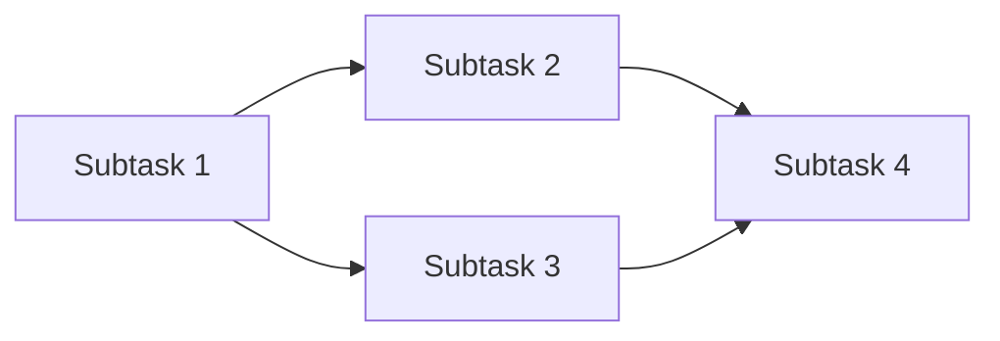

> Structural reference. Adapt headings to `config.documents.language`.

````markdown
# Solution Design Format (max 100 lines)

# Solution Design: {task-name}

**Based on:** `{path-to-feasibility-report}`
**Created:** {date}
**Next step:** `/app-dev-suit:implement-tdd -s <this-file>`

## Requirements

{requirements summary — max 20 lines}

## Implementation Items (Initial Design)

- Data layer: {changes}
- Domain layer: {changes}
- UI layer: {changes}

## Risks / Concerns

- {performance impact}
- {compatibility with existing features}

## Subtask List

1. {subtask name: summary} - Est: 1-2h
2. {subtask name: summary} - Est: 2-3h
...

## Precedence Diagram



**Dependency Depth:** {N}

## High-Level Test Cases

1. When user does X, Y is displayed
2. Invalid input shows error message

## Details

- [Test Cases](./solution_details/test_cases.md)
- [Subtask Details](./solution_details/subtasks.md)
- [File Changes](./solution_details/file_changes/)

## Quality Metrics

{metrics summary}

## Next Actions

1. Review this solution design
2. Run the following command to proceed:
   `/app-dev-suit:implement-tdd -s {actual-output-path}`
````
