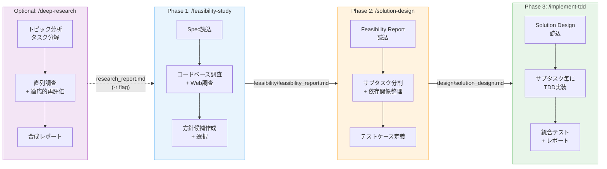
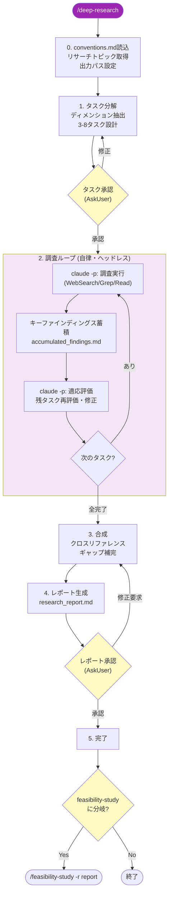
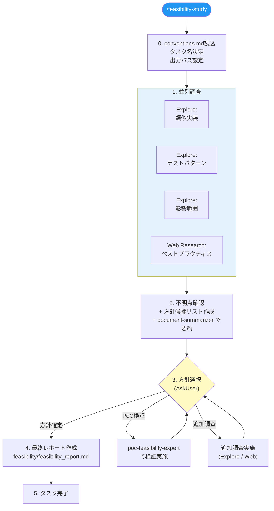
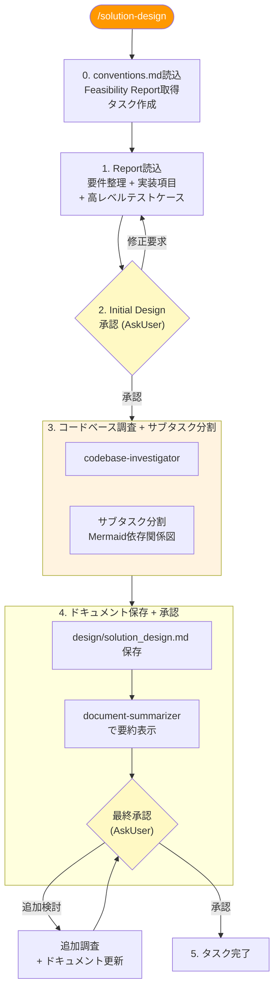
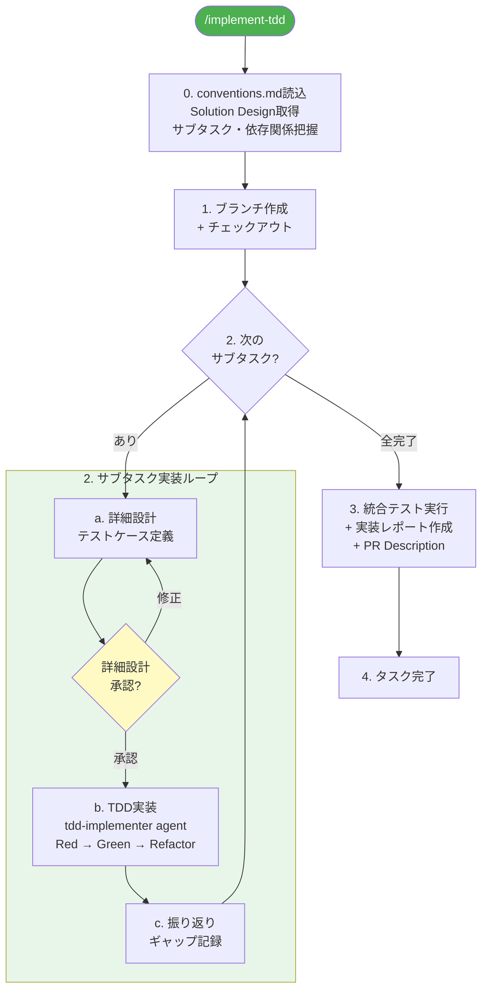

# enterprise-dev-suite Workflow Diagrams

## 1. Overview

---

## 2. Detailed Flow

### Deep Research (Optional)

### Phase 1: Feasibility Study

### Phase 2: Solution Design

### Phase 3: TDD Implementation

### Supporting System

```mermaid
flowchart LR
    subgraph Skills["User-Invocable Skills"]
        DR["/deep-research"]
        FS["/feasibility-study"]
        SD["/solution-design"]
        IT["/implement-tdd"]
        SF["/small-feature"]
        GS["/generate-slides"]
    end

    subgraph Agents["Subagents"]
        EX["Explore\nコードベース探索"]
        CI["codebase-investigator\n3相反復探索"]
        WR["web-research-expert\n技術調査"]
        POC["poc-feasibility-expert\nPoC実装"]
        TDD["tdd-implementer\nTDD実装"]
        DS["document-summarizer\n要約生成"]
    end

    subgraph Conventions["Conventions"]
        CV["conventions.md\nDefaults テーブル"]
    end

    Skills --> Agents
    Conventions -.->|"Step 0で読込"| Skills

    style Agents fill:#e0f2f1,stroke:#009688
    style Conventions fill:#fafafa,stroke:#9E9E9E
```

