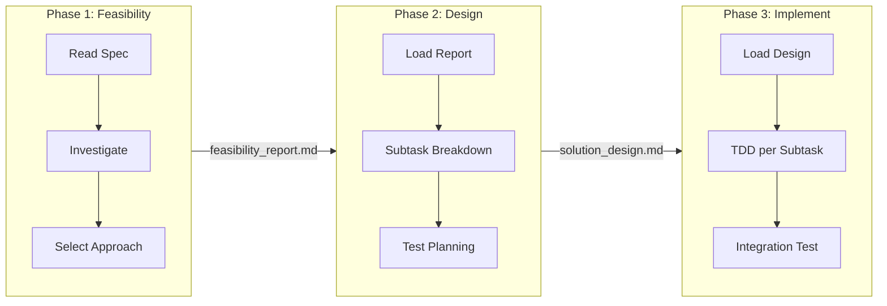
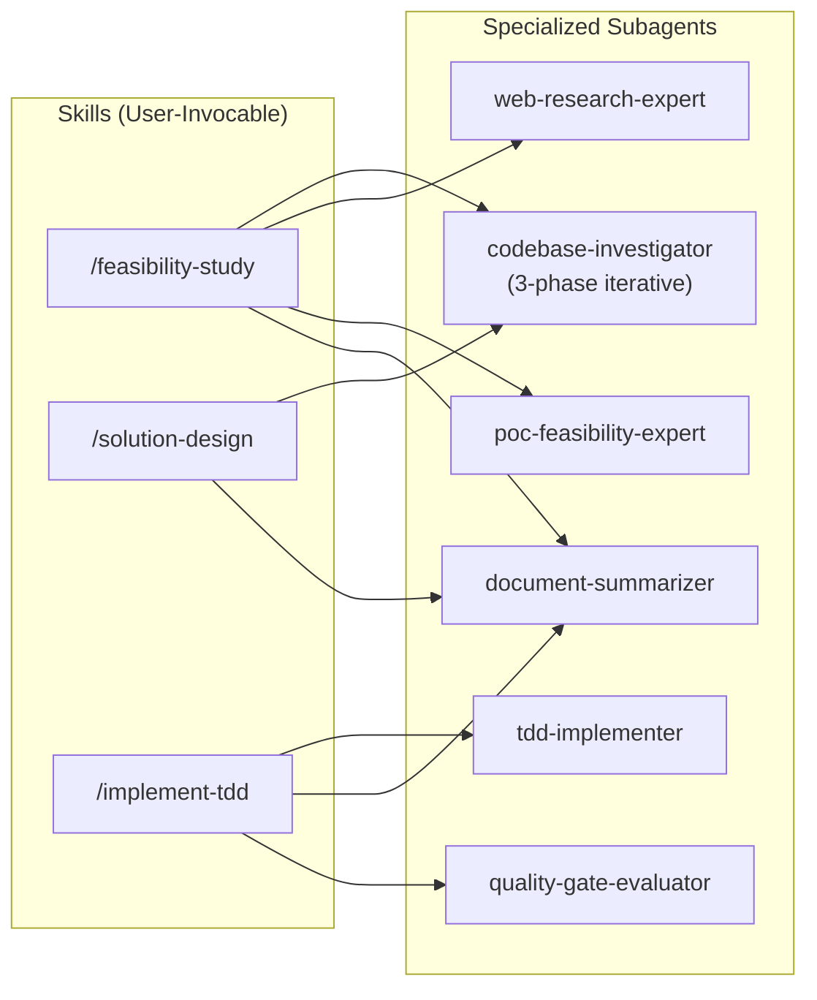
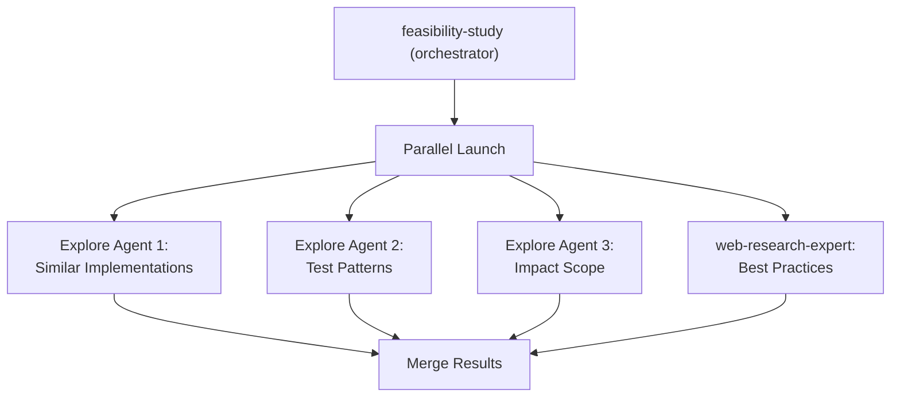

<!-- _class: lead -->

# Automating Dev Workflow and Letting AI Do It

**Reducing manual instructions so AI works autonomously**

Knowledge Sharing — Feb 2026

---

## The Problem

**Current AI-assisted development has friction:**

- You still have to **manually instruct** every step
- Plan Mode works well, but the process is a **black box**
  - Plans live only in the conversation — no persistent artifacts
  - No document generation for team review
  - Typically produces a **single branch, single commit** for the entire implementation
- **Traceability is low** — hard for reviewers to follow what happened and why

> **Goal:** Build a workflow where AI follows a structured process autonomously, producing reviewable artifacts at each stage.

---

## What We Built: app-dev-suite Plugin

**Three-phase workflow with document checkpoints:**

```
/feasibility-study  →  /solution-design  →  /implement-tdd
```



Each phase produces **a structured document** = clear checkpoint for review.

---

## Architecture: Skills & Agents



- Skills = **orchestrators** (coordinate agents, manage flow)
- Agents = **specialists** (each has a focused role)

---

## Key Design: Parallel Investigation

**Phase 1 launches multiple agents in parallel:**



- **codebase-investigator** internally spawns 3 parallel Explore agents
- Web research runs **concurrently** with codebase exploration
- Results are merged into a unified analysis

---

## Key Design: Subtask-Based Branching

**Phase 3 creates a branch per subtask:**

```
feature/my-feature          ← base branch
├── subtask/setup-models    ← TDD: Red → Green → Refactor → Merge
├── subtask/add-api         ← TDD: Red → Green → Refactor → Merge
├── subtask/create-ui       ← TDD: Red → Green → Refactor → Merge
└── subtask/integration     ← TDD: Red → Green → Refactor → Merge
```

- Each subtask = **independent branch** with its own commit history
- User approval required **before each merge**
- Reviewers can inspect each subtask in isolation

---

## Key Design: Document Checkpoints

Each phase outputs structured documents:

| Phase | Output | Purpose |
|-------|--------|---------|
| Feasibility | `feasibility_report.md` + `feasibility_details/` | Validate approach, record alternatives |
| Design | `solution_design.md` + `solution_details/` | Subtasks, dependencies, test cases |
| Implementation | `implementation_report.md` | Results, issues, PR description |

**Benefits:**
- **Early course correction** — review feasibility before design starts
- **Team visibility** — anyone can read the documents, not just the person running AI
- **Audit trail** — decision rationale is preserved

---

## Results: What Worked

**Document generation + subtask-based branching:**
- Each step becomes **independently reviewable**
- Feasibility report catches bad approaches **before** wasting implementation time
- Design document with Mermaid diagrams makes subtask dependencies **visible**
- Per-subtask branches make code review **granular and manageable**

**Parallel investigation:**
- Multiple Explore agents scanning the codebase concurrently
- Web research happening at the same time
- Significantly faster and more thorough than sequential investigation

---

## Results: What Didn't Work

**Execution time increased significantly vs Plan Mode:**
- Plan Mode: single pass, fast execution
- app-dev-suite: multi-phase with checkpoints → **much slower**
- Trade-off: speed vs. traceability and correctness

**AI accuracy degrades with task scope:**
- Small, well-scoped subtasks → generally correct
- Large, complex tasks → **error rate climbs noticeably**
- The more you ask AI to do at once, the more mistakes it makes

---

## Learnings

### 1. Parallel subagents are highly effective for investigation

Launching multiple agents to explore different concerns concurrently:
- **Faster** than sequential investigation
- **Better context efficiency** — each agent has a focused scope
- Built-in Explore agent is a great building block

### 2. AI output verification is essential

- AI still makes mistakes — especially at scale
- Quality gates and document checkpoints are not optional luxuries
- The structured workflow **forces** you to review before proceeding

---

## Learnings (cont.)

### 3. The Bitter Lesson: Less is More

> Over 50% of the original prompts were **removed** in the final version.

- Complex, detailed prompts → AI gets confused, drifts from intent
- Simpler, focused prompts → more reliable and consistent output
- **Don't try to do too much** — it backfires

### 4. Clone your repo twice for parallel work

```
~/project/          ← You review and iterate here
~/project-claude/   ← AI works autonomously here
```

- Run AI on one clone while you work on the other
- Merge results when AI finishes
- **Doubles effective productivity**

---

## Summary

| Aspect | Plan Mode | app-dev-suite |
|--------|-----------|---------------|
| Speed | Fast | Slower (multi-phase) |
| Traceability | Low (conversation only) | High (document artifacts) |
| Reviewability | Difficult | Easy (per-phase, per-subtask) |
| Error detection | After the fact | At each checkpoint |
| Best for | Quick solo tasks | Team projects, larger features |

**Key takeaway:** Structuring AI's work into phases with document checkpoints makes the output **reviewable and correctable** — at the cost of execution time.

---

<!-- _class: lead -->

# Questions?

**Try it out:**
```
/plugin marketplace add taakashifukada/app-dev-prompt-suite
/plugin install app-dev-suite@app-dev-prompt-suite
```

**Repo:** `taakashifukada/app-dev-prompt-suite` (branch: `poc/lightening`)

